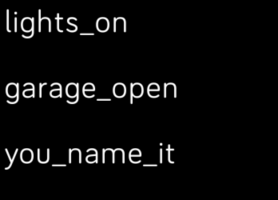

# All Things Automated

Triggers IFTTT (www.ifttt.com) events using the Webhooks channel

Put the power of IFTTT on your wrist!

To use:
1. Enable the IFTTT Webhooks Channel (https://ifttt.com/maker_webhooks)

2. Create an applet to trigger from your Fitbit
  a. Create a new applet triggered by the Webhooks Channel. For "if +this," choose the trigger "receive a web request" from the Webhooks Channel
  b. Choose something short for the "Event Name"
  c. Select whatever you want to trigger for "then +that"
  
3. Set up the All Things Automated App to activate your trigger.
  a. Paste your IFTTT Webhooks key into the app settings.
    i. Navigate to the "Services" tab of the IFTTT mobile app
    ii. Select "Webhooks"
    iii. Select "Documentation"
    iv. Copy the key under "Your key is:"
    v. Paste the key into the settings in the All Things Automated settings screen in the Fitbit mobile app.
  b. Enter the event names (max of 6 for now) into the list in settings.
  
Tap the event name to trigger it. When the IFTTT server responds, the last response date will be displayed underneath the event name. Any errors will be displayed there as well.
  
## License

[MIT License](./LICENSE)